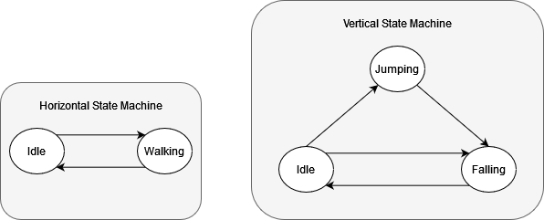

# Super Sussy Bros
Lucius Vinicius Rocha Machado Filho - 96123

Luis Pedro Carvalho Chaves (jetbrains lover) - 114683

## Game Concept
Super Sussy Bros is based on the Mario Bros game from the Nintendo Entertainment System (NES) console. It consists of a 2D platformer in a closed environment where enemies spawn given enough time.  The goal of the player is to perform the highest score eliminating enemies until it loses.

## Gameplay
As stated before, the gameplay is of a simple 2D platformer where the player can move horizontally and jump. The jump is useful to reach higher platformers/objects, perform dodges against enemies and for destroying enemies, the goal of the game.

## Game Patterns
The list of used development patterns to create Super Sussy Bros and the reason for each one.

### Bytecode
The bytecode patterns was used in two situations:

- Game Statistics: The physic’s variables like gravity and speed of entities are stored in a [configuration file](projeto/config.json) which is customizable. The enemy score and spawn rate are also stored there. In the case of enemies’ speed, the file stores the range they may acquire, since their speed is random. For more details of enemy speed and types, checkout the [Type Object pattern section](#type-object);
- Level: The level itself is created in ASCII in a [custom file](projeto/maps/test1.map). It is possible to set up the player’s starting position, enemy spawners, POW objects and the level tiles themselves.

### Command
The command pattern was used to get player inputs more dynamically. Applying this pattern made it possible to easily adjust modification to inputs.

For instance, in the project’s beginning, the input logic was bad-implemented and the player couldn’t press more than one button at the same frame that the game state was forever wrong.

The Command process is done on the [handle_input function](projeto/source/input_manager.py), which is called by the [engine.](projeto/source/engine.py)

### Component
To simplify math at some points and reduce possible refactor situations, the graphic part of each entity is separated from the entity itself. This enables the management of variables like positions, directions independently from the size of the image or hitboxes, which are included on the graphic component.

The [Sprite Component](projeto/source/sprite_component.py) is also responsable to set up and manage animations and collisions.

(To Luís: Tu q fez, ent acho q tu consegue tbm elaborar melhor do que eu nisso)

### Double Buffer
The Render Manager processes all render operations. It applies the Double Buffer pattern, since it is the default method which PyGame utilizes to render the scene.

First the Render Manager fills the scene with the background color, then proceeds to render all existent actors and text. Only after rendering everything, it changes the buffer to show the output.

### Flyweight and Singleton
We combined both patterns into one by having two manager objects, one for [sound effects](projeto/source/sound_loader.py) and another for [images](projeto/source/render_manager.py), which function the same way.

Those managers should be global and load the assets just once. So, to make it global, a Singleton was used, where just one instance could be created, and this instance stored all the assets that needed to be used.

When an object wants to use the corresponding asset, it gets the created instance and obtains the image directly from it.

### Observer
In the project, there are two major uses for the Observer:

- [Collision Manager](projeto/source/collision_manager.py): Checks the collisions of the entities and calls their respective “on_collision” method when triggered; (DPS EXPANDIR COM O LUÍS UPDATE)
- [Signal Manager](projeto/source/signal_manager.py): Entities can call the manager to listen to a specific signal. When a signal is emitted by something, on every entity their “on_signal” method is called. One example of use is when a player hits the POW object, where a signal is sent to every enemy alive to be destroyed.

### Prototype
To summon enemies, the game has an [enemy spawner object](projeto/source/enemy_spawner.py), and when a set amount of time has passed it would produce more enemies into the map.

### Service Locator
Our project has a main [Engine class](projeto/source/engine.py), where all the actors, text, levels that will be used in the game are added. 

#### Actor
Every actor added via the “add_actor” method is added to the Render Manager through the Engine. Later they are updated in the Engine’s own update and lastly, in the Later Update phase, the Engine calls the Render Manager to render every actor.

(Review phrase, i think that I wrote it very badly (tired probably)

#### Level
After the initial setup, the engine requires a Level object to be added through the “add_level” method. The level then is loaded and stored in the engine.

Later, for example, all dead actors need to check if they are still on the viewport or if they can be eliminated and, to analyze that, they get the level through the engine itself to make the operations with its size. If the actors are not in the level area, they call the engine to remove themselves and destroy their sprites.

#### Text
Similarly to the actors, but without an update call, because texts are only rendered.

(N SEI SE O SERVICE LOCATOR FICOU TÃO BEM EXPLICADO OU MUCHO TEXTO, MAYBE REFORMULAR LATER)

### States and State Machine
Used mostly by the player entity, the [player's states](projeto/source/player_states.py) were used to see if the player is walking, jumping, falling or idle and processing the input correctly (for instance, the player cannot jump if it is already in the air).

Because there are two independent movements (horizontal and vertical), two state machines were created for [the player](projeto/source/player.py), and therefore the states do not interfere with each other.
The Horizontal State Machine has “Idle” and “Walking” as states, which are altered when the player presses “A” or “D” to move, or does not have any of those pressed.

The Vertical State Machine owns “Idle”, “Jumping” and “Falling” as states. The player can only jump if it is not moving vertically at all. From “jumping” you can only go to “falling”, which is the only way to return to “idle”, when the player lands.

Fig. Player state diagram.

### Type-Object:
As stated in the [Bytecode pattern](#bytecode), there is a [configuration file](projeto/config.json) where the stats are stored, which include enemy minimum and maximum speed and score for each enemy type: Slow or Fast. When the [Spawner](projeto/source/enemy_spawner.py) creates enemies, it verifies the chance of spawning a fast enemy (also stored on the configuration file), and then proceeds to instantiate the correct type.

An [enemy type](projeto/source/enemy_default.py) is composed by its score and speed, which is generated in the interval given by the configuration file. Because the enemy has two types, with different speed ranges and score, it was used then the Type-Object pattern.

### Update Method and Game Loop:
Every entity that is processed on [the engine](projeto/source/engine.py) has an isolated update method that simulates one game’s frame. In our case, there is 3 times from updates being:

- Early update: This update is used to check the inputs, which should be analyzed before applying player’s physics and movements;
- Update: Regular update, where every actor is processed without a specific order. After the entities update, the engine also runs the Collision Manager update to check if there was a collision this frame and process “on_collision” events;
- Late Update: This update is exclusive to render the graphics after the alterations on the game.

These 3 different times consist in the Game Loop pattern.
